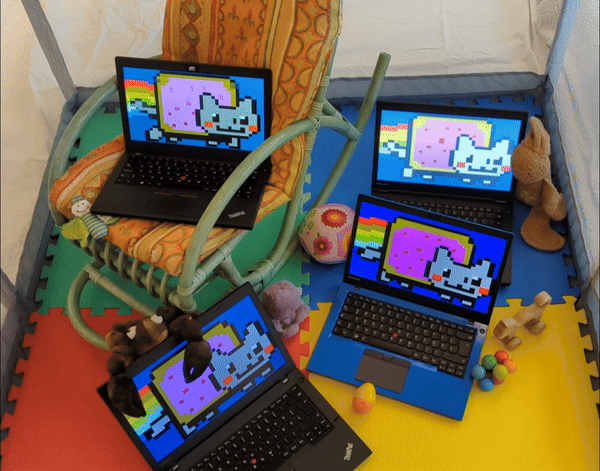
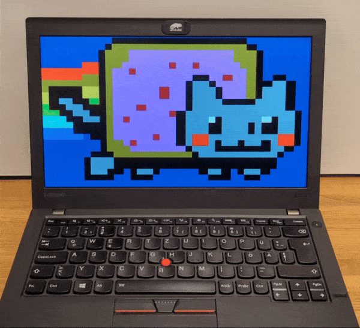
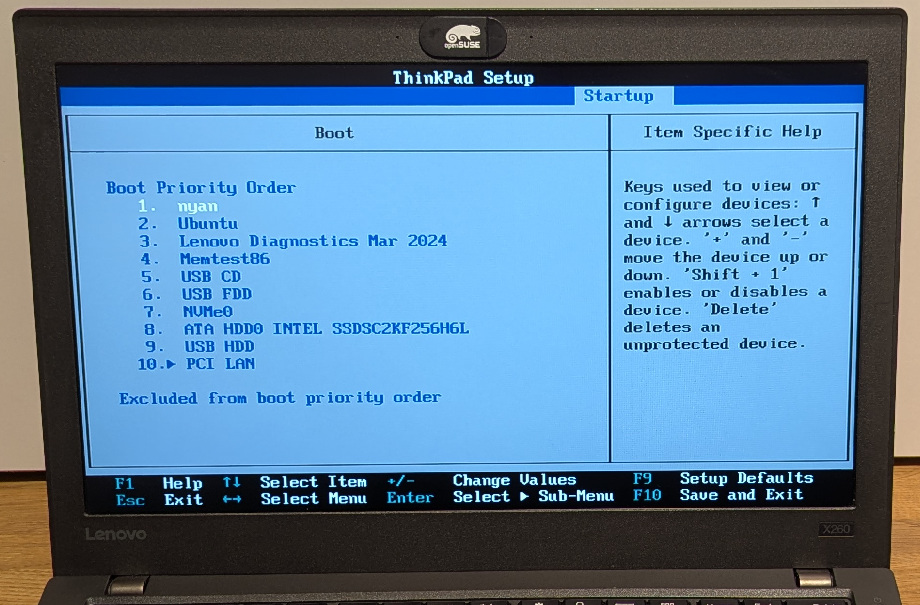

# UEFI NYAN 80x25



# The Making of UEFI NYAN 80x25

Booting directly into nyan cat.

This repository contains the story how nayn cat was ported to the EFI Simple Text Output Protocol.
Nyan cat is now an UEFI application.
You can directly boot into nyan cat.
Windows 10 support is running out?
Use nyan cat as your new OS!
Linux is too complicated?
Use nyan cat as your new OS!
BSDs are too esoteric?
Use nyan cat as your new OS!
macOS does not natively run on ThinkPads?
Use nyan cat as your new OS!




## List of Features

* It displays nyan cat.

That's it.

## How UEFI NYAN 80x25 was built

:crab: :cat: :crab:

* Part 1) [Getting Rust](getting_rust/)
* Part 2) [Hello World](hello_world/)
* Part 3) [The EFI Simple Text Output Protocol](efi_simple_text_output_protocol/)
* Part 4) [Nyan Cat to Rust Array](drawing_nyan/)
* Part 5) [Putting it all together](putting_together/)

## Installation

```bash
$ cd nyan
$ cargo build --release
$ cargo run --release
$ # assume /boot/efi/ is your mounted EFI system partition
$ sudo mkdir /boot/efi/EFI/nyan/
$ sudo cp target/x86_64-unknown-uefi/release/nyan.efi /boot/efi/EFI/nyan/bootx64.efi
$ sudo efibootmgr --create --disk /dev/sda --part 1 --label "nyan" --loader \\EFI\\nyan\\bootx64.efi 
```

Then set `nyan` as the first boot entry in your firmware setup.



Boot directly into nyan cat.

<!-- putting_together/img/nyanrainbowboot.mp4 -->
<video src="https://github.com/user-attachments/assets/ec1cef35-ca0b-4458-9f66-3592e0796aed" controls>
</video>


