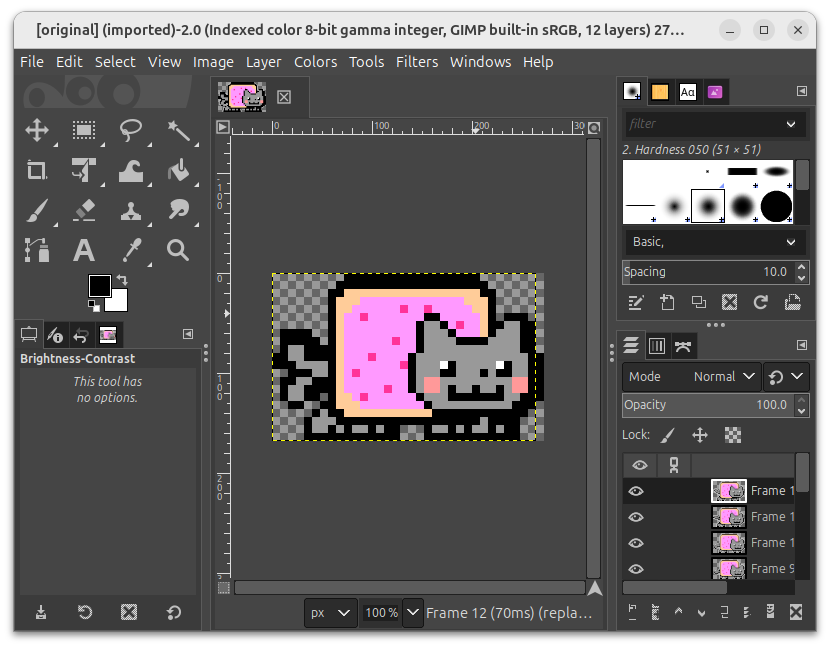

# Nyan Cat

It's time to draw nyan cat in 80x25 UEFI UCS-2 `BLOCKELEMENT_FULL_BLOCK`s.

## Getting Nyan Cat

Here is nyan cat:


It's probably copyrighted, so if someone asks, we pretend an AI drew that image for us.
Just kidding.
It's the original nyan cat by prguitarman from https://nyan.cat/.
Huge thanks to Chris Torres for allowing me to use it for this project! :heart:

## Downsizing Nyan Cat

Let's downsize that image to 80x25.
Here it is opened in Gimp.



The first thing I notice is that it has many legs and tails.
That's because it's an animated gif and Gimp shows all frames simultaneously.
See the panel on the bottom right.

Let's limit ourselves to the first frame only for now.


Let's downsize it.
It currently is 272x168 pixels high.


To preserve the aspect ration, the largest we can go is 40x25 pixels.


That doesn't look good!
When zooming in, we se transparent pixels and artifacts that look like anti aliasing.
First of all, that just doesn't look good at that tiny size.
Second, nyan cat is pixel art, anti aliasing doesn't belong here.
Third, the UEFI simple text output protocol wouldn't support those colors anyway.

Let's try again.
In the above "Scale Image" dialog, we stuck with the defaults.
See the interpolation "Cubic" in there?
We don't want interpolation.
We want pixel perfect downsizing.

Let's try again, but this time, without interpolation.


Purrrfect! :cat:


## Nyan to Vec

### Exporting Nyan Cat

We want to turn this picture into a Rust vector of UEFI colors.
So we somehow want to export this into an uncompressed binary list of colors.

Surely, exporting the image as raw image data in RGB is what we are looking for.


I need to be honest: I tried parsing and understanding the resulting `.data` file for quite some time.
But I failed.
I could not figure out how to parse this data.
When loading back the image into Gimp, I need to manually specify the width and the size.
So I assume, there is no header with metadata.
Also, the beginning of the file looks like it just starts with the raw transparent pixels:

```bash
$ xxd original.data | head
00000000: 0000 0000 0000 0000 0000 0000 0000 0000  ................
00000010: 0000 0000 0000 0000 0000 0000 0000 0000  ................
00000020: 0000 0000 0000 0000 0000 0000 0000 0000  ................
00000030: 0000 0000 0000 0000 0000 0000 0000 0000  ................
00000040: 0000 0000 0000 0000 0000 0000 0000 0000  ................
00000050: 0000 0000 0000 0000 0000 0000 0000 0000  ................
00000060: 0000 0000 0000 00ff 00ff 00ff 00ff 00ff  ................
00000070: 00ff 00ff 00ff 00ff 00ff 00ff 00ff 00ff  ................
00000080: 00ff 00ff 00ff 00ff 00ff 00ff 00ff 0000  ................
00000090: 0000 0000 0000 0000 0000 0000 0000 0000  ................
```

Long story short: I could not figure out how to parse this format.
The file is exactly 2000 bytes long.
If I understood the export dialog correctly, the format should be RGB, with at least one byte per color value.
But 2000 isn't divisible by 3.
In addition, the image is 40x25 in size.
But 2000 isn't divisible by 25 as well.

I don't understand the format.
But surely Gimp does, since it created it, right?

Specifying the correct size during the import, this is what I got back:


Okay, if even Gimp cannot understand its own file format, maybe something is truly wrong.
If you know what happened here, please let me know.

I didn't find information in the Gimp docs about this data format.
So it's time to read the Gimp sources, right?
Well, I just want to export nyan cat, maybe there is a simpler solution?
We don't care about efficiency.
Some self-documenting file format?

ASCII art?

```raw                    
     ]#########[    
    ]#XXX2XYSX##    
    ]ZoXXXr_/2XX _, 
    ]ZXXXX[o2]SX)o( 
 _, ]ZSXSu(nns__Sn( 
 "s_]ZXuX2)vq{oXq{n 
   "]ZuXXX)ns)oss)S 
    ]ZXX2X)oo{o{}oX 
    ]#oXXXs"o__s_r' 
   v,"!!!!!!   _    
   n' _     _  v    
```

No, I want colors!

Scrolling through the supported file type, I see HTML table.
That would be perfect!


No luck for me?
It really looks like obscure rarely-used file formats are not super well supported?

By the way, I re-tried all those things a few times with Gimp versions around 2.10.38 and 3.0

Okay, why would an HTML table exporter fall over?
Transparency?
Animation frames?
Multiple layers?

Let's get rid of all those snares.
Let's copy the first frame into a blank new canvas with blue background.


Then export as HTML table.
Starting from Gimp 3, it looks like selecting `HTML table` explicitly is required, since normal HTML export creates more fancy exports.
Too fancy for UCS-2.


Whatever.
Probably the two types of Gimp HTML exports compete?
Whatever.


Looks good.

A file [nyan.html](img/nyan.html) was created.


Awesome! :heart_eyes_cat:

This really looks like it was meant to be rendered by UEFI UCS-2 `BLOCKELEMENT_FULL_BLOCK`.

[back](../)