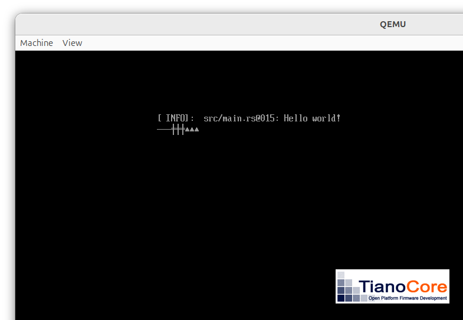
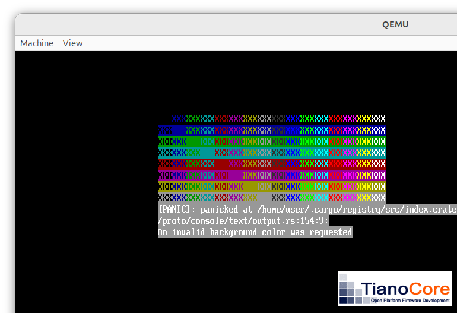
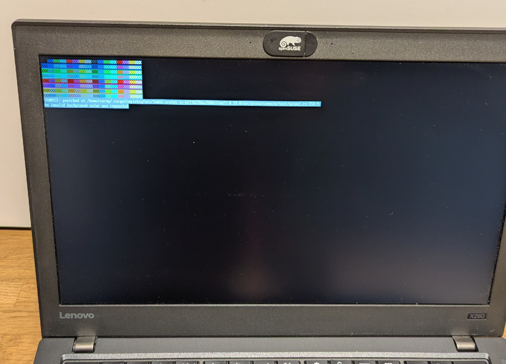
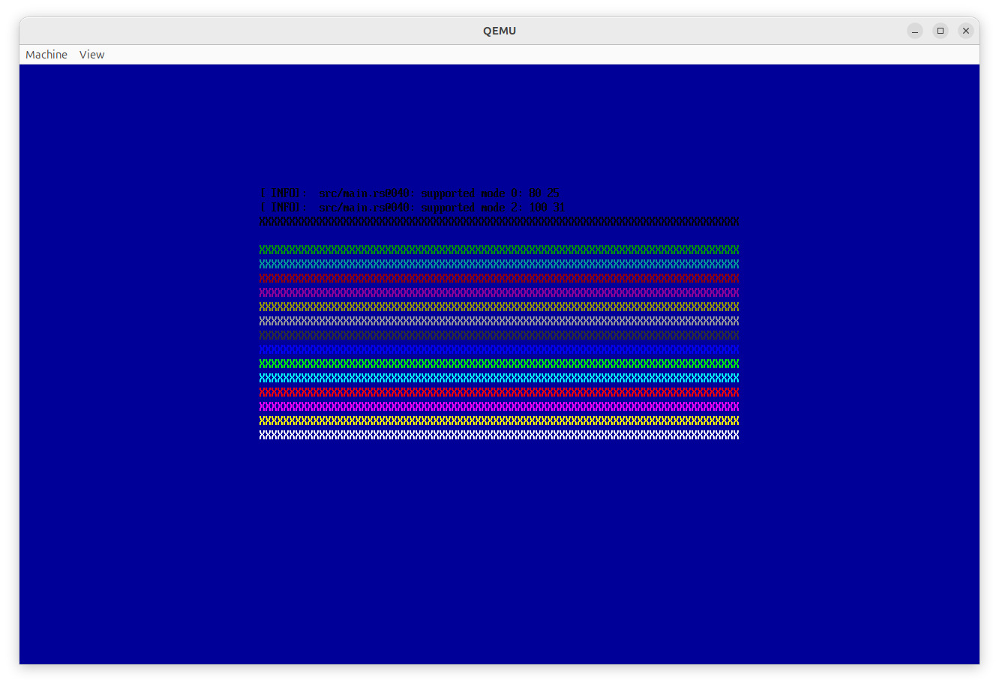
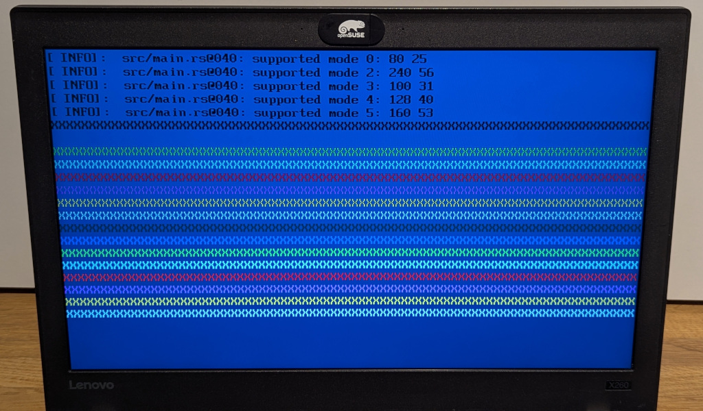

# The EFI Simple Text Output Protocol

The [EFI_SIMPLE_TEXT_OUTPUT_PROTOCOL](https://uefi.org/specs/UEFI/2.10/12_Protocols_Console_Support.html#efi-simple-text-output-protocol) provides a way to output text.
It's a feature provided by the ~~BIOS~~ UEFI.

An UEFI app can use it to output strings to the screen.

In UEFI land, the string encoding is [UCS-2](https://en.wikipedia.org/wiki/Universal_Coded_Character_Set), which combines the downsides of UTF-16 with the non-support of UCS-2 in any modern programming language.

To ask UEFI to do something, each UEFI app is basically passed a pointer to the [`EFI_SYSTEM_TABLE`](https://uefi.org/specs/UEFI/2.10/04_EFI_System_Table.html?highlight=efi_system_tabl#efi-system-table) in the `main` function.
This `EFI_SYSTEM_TABLE` is full of pointers to all the services provided by UEFI.
UEFI calls these services [Boot Services](https://uefi.org/specs/UEFI/2.10/07_Services_Boot_Services.html).
One of these services is the `EFI_SIMPLE_TEXT_OUTPUT_PROTOCOL`.

About 5 years ago, I [experimented with a minimal and raw UEFI application](https://github.com/diekmann/uefi_playground/tree/master) —a C and Rust hybrid— to just print "Hello, World" from scratch.
Fortunately, the world has moved on and we no longer need such raw from scratch setups.
We will trust in the Rust [`uefi` crate](https://docs.rs/uefi/latest/uefi/) to provide a lot of convenience for us.
That's the crate which also provides the great [Rust UEFI book](https://rust-osdev.github.io/uefi-rs/).


## Outputting some Strings

Currently, our `Hello, World` is

```rust
#![no_main]
#![no_std]

use log::info;
use uefi::prelude::*;

#[entry]
fn main() -> Status {
    uefi::helpers::init().unwrap();
    info!("Hello world!");
    boot::stall(10_000_000);
    Status::SUCCESS
}
```

But this `log::info` abstracts away the raw `EFI_SIMPLE_TEXT_OUTPUT_PROTOCOL` we want to talk to.
Let's figure out how the `info!` macro actually writes to the screen.
It somehow must use the `EFI_SIMPLE_TEXT_OUTPUT_PROTOCOL` with a handle it got from the efi system table.

Looking into the definition of the `info` macro is not helpful, since this macro lives in the `log` crate, and that crate is not specific for UEFI.

So let's look at what `uefi::helpers::init()` does.
This looks interesting: It calls `logger::init`, which lives in the `uefi` crate.
I think we are on the right track.
Here is the definition of `init`, from `uefi-0.33.0/src/helpers/logger.rs`:

```rust
/// Set up logging
///
/// This is unsafe because you must arrange for the logger to be reset with
/// disable() on exit from UEFI boot services.
pub unsafe fn init() {
    // Connect the logger to stdout.
    system::with_stdout(|stdout| {
        LOGGER.set_output(stdout);
    });

    // Set the logger.
    log::set_logger(&LOGGER).unwrap(); // Can only fail if already initialized.

    // Set logger max level to level specified by log features
    log::set_max_level(log::STATIC_MAX_LEVEL);
}
```

So this is how this generic `log` crate gets initialized to talk to the EFI Simple Text Output Protocol.
And `system::with_stdout` is exactly what we are looking for.
It's documentation is

```rust
/// Call `f` with the [`Output`] protocol attached to stdout.
```

and the implementation does exactly what we thought it should do:
Get the output protocol pointer fro the efi system table and wrap it in a safe way into the `stdout` variable:

```rust
/// Call `f` with the [`Output`] protocol attached to stdout.
///
/// # Panics
///
/// This function will panic if called after exiting boot services, or if stdout
/// is not available.
pub fn with_stdout<F, R>(f: F) -> R
where
    F: Fn(&mut Output) -> R,
{
    let st = table::system_table_raw_panicking();
    // SAFETY: valid per requirements of `set_system_table`.
    let st = unsafe { st.as_ref() };
    // The I/O protocols cannot be used after exiting boot services.
    assert!(!st.boot_services.is_null(), "boot services are not active");
    assert!(!st.stdout.is_null(), "stdout is not available");

    let stdout: *mut Output = st.stdout.cast();

    // SAFETY: `Output` is a `repr(transparent)` wrapper around the raw output
    // type. The underlying pointer in the system table is assumed to be valid.
    let stdout = unsafe { &mut *stdout };

    f(stdout)
}
```

Great!
So, `system::with_stdout` is the function we want to use!

Let's see if we can use it.

```rust
#![no_main]
#![no_std]

use log::info;
use uefi::prelude::*;

#[entry]
fn main() -> Status {
    uefi::helpers::init().unwrap();
    info!("Hello world!");
    let s: &uefi::CStr16 = cstr16!("Hello, World! From raw EFI_SIMPLE_TEXT_OUTPUT_PROTOCOL");
    system::with_stdout(|stdout| -> uefi::Result{
        stdout.output_string(&s)?;
        Ok(())
    }).expect("talking to EFI Simple Text Output Protocol went wrong");
    boot::stall(10_000_000);
    Status::SUCCESS
}
```

The [`cstr16` macro](https://docs.rs/uefi/latest/uefi/prelude/macro.cstr16.html) is really convenient, since it handles the UCS-2 strings for us.
Without it, we would probably have to write down our string manually as an array of 16 bit encoded characters.

```bash
$ cargo run
```


Nice!

## Outputting some interesting Strings

UCS-2 is not Unicode.
And the EFI specification [defines some interesting characters](https://uefi.org/specs/UEFI/2.10/12_Protocols_Console_Support.html#efi-simple-text-output-protocol-outputstring).

Let's see what the following are:

```C
#define BOXDRAW_HORIZONTAL             0x2500
...
#define BOXDRAW_VERTICAL_HORIZONTAL_DOUBLE 0x256a
...
#define GEOMETRICSHAPE_UP_TRIANGLE     0x25b2
```

I could not see if the `cstr16` macro supports escape sequences, so let's build those characters by hand.

```rust
#![no_main]
#![no_std]

use log::info;
use uefi::prelude::*;

const BOXDRAW_HORIZONTAL: uefi::Char16 = unsafe {uefi::Char16::from_u16_unchecked(0x2500 as u16)};
const BOXDRAW_VERTICAL_HORIZONTAL_DOUBLE: uefi::Char16 = unsafe {uefi::Char16::from_u16_unchecked(0x256a as u16)};
const GEOMETRICSHAPE_UP_TRIANGLE: uefi::Char16 = unsafe {uefi::Char16::from_u16_unchecked(0x25b2 as u16)};

#[entry]
fn main() -> Status {
    uefi::helpers::init().unwrap();
    info!("Hello world!");
    system::with_stdout(|stdout| -> uefi::Result{
        let mut s = uefi::CString16::new();
        s.push(BOXDRAW_HORIZONTAL);
        s.push(BOXDRAW_HORIZONTAL);
        s.push(BOXDRAW_HORIZONTAL);
        s.push(BOXDRAW_VERTICAL_HORIZONTAL_DOUBLE);
        s.push(BOXDRAW_VERTICAL_HORIZONTAL_DOUBLE);
        s.push(BOXDRAW_VERTICAL_HORIZONTAL_DOUBLE);
        s.push(GEOMETRICSHAPE_UP_TRIANGLE);
        s.push(GEOMETRICSHAPE_UP_TRIANGLE);
        s.push(GEOMETRICSHAPE_UP_TRIANGLE);
        stdout.output_string(&s)?;
        Ok(())
    }).expect("talking to EFI Simple Text Output Protocol went wrong");
    boot::stall(10_000_000);
    Status::SUCCESS
}
```

```bash
$ cargo run
   Compiling nyan v0.1.0 (/home/user/git/uefi_nyan_80x25/nyan)
error[E0433]: failed to resolve: could not find `CString16` in `uefi`
   --> src/main.rs:17:27
    |
17  |         let mut s = uefi::CString16::new();
    |                           ^^^^^^^^^
    |                           |
    |                           could not find `CString16` in `uefi`
    |                           help: a struct with a similar name exists: `CStr16`
    |
note: found an item that was configured out
   --> /home/user/.cargo/registry/src/index.crates.io-6f17d22bba15001f/uefi-0.33.0/src/lib.rs:259:21
    |
259 | pub use data_types::CString16;
    |                     ^^^^^^^^^
note: the item is gated behind the `alloc` feature
   --> /home/user/.cargo/registry/src/index.crates.io-6f17d22bba15001f/uefi-0.33.0/src/lib.rs:258:7
    |
258 | #[cfg(feature = "alloc")]
    |       ^^^^^^^^^^^^^^^^^
```

WOW.
This is a really great compiler message.
So far, we did not use any data structure on the heap.
Everything was on the stack.
But `uefi::CString16` is a dynamically-sized data structure (and we are `push`ing to it quite extensively).
A `uefi::CString16` lives on the heap.
To use the heap, we need some memory allocator.
But all the memory belongs to UEFI.
Fortunately, there is an UEFI service to [allocate memory](https://uefi.org/specs/UEFI/2.10/07_Services_Boot_Services.html#memory-allocation-services).

More fortunately, the `uefi` crate already allows using the UEFI memory allocator seamlessly.
Let's add `"alloc"` and `"global_allocator"` to our `uefi` `features` in the `Cargo.toml`"

```toml
[package]
name = "nyan"
version = "0.1.0"
edition = "2021"

[dependencies]
log = "0.4.22"
uefi = { version = "0.33.0", features = ["alloc", "global_allocator", "logger", "panic_handler"] }

```

```bash
$ cargo run
```




Nice!

## Outputting some colorful Strings

The EFI Simple Text Output Protocol also [supports colors](https://uefi.org/specs/UEFI/2.10/12_Protocols_Console_Support.html#efi-simple-text-output-protocol-setattribute).
In total, it supports 16 colors, half of them can be used as background.
And the Rust `uefi` crate also [supports those colors](https://docs.rs/uefi/latest/uefi/proto/console/text/enum.Color.html).

Let's look at some colors:

```rust
#![no_main]
#![no_std]

use core::fmt::Write;

use uefi::prelude::*;
use uefi::proto::console::text::Color::*;

#[entry]
fn main() -> Status {
    uefi::helpers::init().unwrap();
    let colors = [
        Black,
        Blue,
        Green,
        Cyan,
        Red,
        Magenta,
        Brown,
        LightGray,
        DarkGray,
        LightBlue,
        LightGreen,
        LightCyan,
        LightRed,
        LightMagenta,
        Yellow,
        White,
    ];
    system::with_stdout(|stdout| -> uefi::Result {
        for background in colors {
            for color in colors {
                stdout.set_color(color, background)?;
                stdout.output_string(cstr16!("XXX"))?;
            }
            stdout.write_char('\n').unwrap(); // core::fmt::Error, not uefi::Error
        }
        Ok(())
    }).expect("talking to EFI Simple Text Output Protocol went wrong");
    boot::stall(10_000_000);
    Status::SUCCESS
}
```

The `write_char` function is not from `uefi`, but from `core::fmt::Write`.
It returns a different error.
That's why I cannot handle errors with `?`.
But I'm too lazy to create yet another `cstr16` and use the UEFI raw Text Output Protocol just to print a newline.


```bash
$ cargo run
```



Some observations

* The colors do look nice.
* The blue background looks nice, which is perfect for nyan cat.
* There are not many colors, which is good enough for nyan cat.
* UEFI really insists that only the first eight colors can be used as background colors.

How does this look on real hardware?



Nice!

## Mode 80x25

I notice that the resolution on my Thinkpad is quite different, compared to qemu.
Looks like we could fit more characters on a line on my Thinkpad than we could fit on a line on qemu.

Turns out the UEFI Simple Text Output Protocol supports different [modes](https://uefi.org/specs/UEFI/2.10/12_Protocols_Console_Support.html#efi-simple-text-output-protocol-querymode).

For now, I don't want to support different ~~resolutions~~ modes.
Is there one mode everyone must support?
The [docs](https://uefi.org/specs/UEFI/2.10/12_Protocols_Console_Support.html#efi-simple-text-output-protocol-querymode) say

> It is required that all output devices support at least 80x25 text mode.

Great!
How do I select this mode?

> This mode is defined to be mode 0

Great!
Let's first set our screen to 80x25 then.
Good old vintage terminal vibes ahead.

```rust
#![no_main]
#![no_std]

use log::info;
use uefi::prelude::*;
use uefi::proto::console::text::Color::*;

#[entry]
fn main() -> Status {
    uefi::helpers::init().unwrap();
    let colors = [
        Black,
        Blue,
        Green,
        Cyan,
        Red,
        Magenta,
        Brown,
        LightGray,
        DarkGray,
        LightBlue,
        LightGreen,
        LightCyan,
        LightRed,
        LightMagenta,
        Yellow,
        White,
    ];
    let background = Blue;
    system::with_stdout(|stdout| -> uefi::Result {
        let must_mode_80x25 = stdout.modes().next().unwrap(); // the first one must be the 80x25 mode.
        stdout.set_mode(must_mode_80x25)?;

        // This seems to paint the whole background blue.
        stdout.set_color(Black, background)?;
        stdout.clear()?;

        // Dump all modes.
        for m in stdout.modes() {
            info!("supported mode {}: {} {}", m.index(), m.columns(), m.rows());
        }
        
        for color in colors {
            stdout.set_color(color, background)?;
            // 80 times X. No newline required, since the mode automatically starts a new line after 80 chars.
            stdout.output_string(cstr16!("XXXXXXXXXXXXXXXXXXXXXXXXXXXXXXXXXXXXXXXXXXXXXXXXXXXXXXXXXXXXXXXXXXXXXXXXXXXXXXXX"))?;
        }
        Ok(())
    }).expect("talking to EFI Simple Text Output Protocol went wrong");
    boot::stall(10_000_000);
    Status::SUCCESS
}
```

Hardcoding 80 `X`es per color without a newline verifies that the screen is now indeed 80 columns wide.




So qemu OVMF only supports mode 80x25 and 100x31.
By the way, the "empty" line after the line with black `X`es is blue `X`es on blue background.

What does my Thinkpad support?



My Thinkpad supports a few more modes.
But 80x25 is the one everyone *must* support.

I really like the blue background.

## Outputting some interesting colorful Strings

**TODO**

Getting close towards painting.

The full wide range of colors is only available for foreground.
Which character?

Find the interesting characters in the docs.

Color test
On real hardware
Photo 
Like blue background.


Step 6
Standardize on graphics mode. Qemu comes up with?
Thinkpad comes up with?


[back](../)