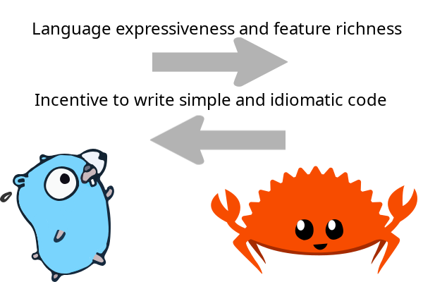
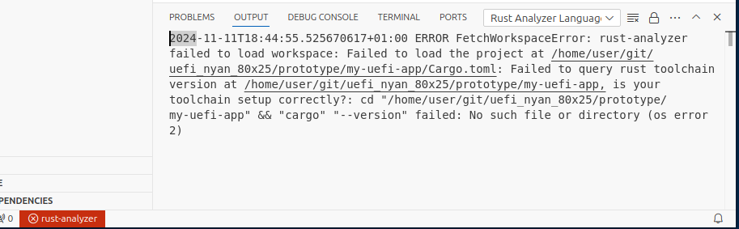

# Getting rust

It's that time of the year again, where I feel like it's a good idea to learn Rust :crab:.
This idea comes up every few years, and I've probably started learning Rust a few times.
Yet, when not using Rust actively, the knowledge fades.
So let's learn Rust again.

## Learning Rust

This time, I used [Comprehensive Rust 🦀](https://google.github.io/comprehensive-rust/) to learn rust.
This was a nice introduction and I enjoyed the exercises.


## Rust vs. Golang

In my day job, I mostly work with Golang nowadays.
The Internet was full of hot takes about Rust vs. Golang.


Personally, I love writing Golang.
But this statement needs some context:
I love writing Golang for work.
Golang, when used idiomatically, is such a nice and easy to read language to work with in a team.

Let's be honest, most of the time, we don't write new software, we work with existing code.
I know that people love writing things from scratch and complain about the existing code.
Just like I never met a handyman who did not complain about the previous handyman and suggested to tear everything out and do it again.
But this is rarely the right choice.
Usually, working with existing systems is the more economic option.
And while we're being honest, when was a rewrite ever smooth?
The existing system probably already solves many problems and corner cases and is often well-tested.
Maybe not in terms of unit tests, but at least in production.
Renovating existing code instead of rewriting is often the best option.




And that's why I like Golang for work so much: The simplicity of the language forces simple code, and when that code is written idiomatically, it's rather easy to jump into an existing code base get started.
In Golang, people often complain about repetition, missing features, and that everything needs to be spelled out explicitly.
People even misquote Rob Pike as describing Golang as a [dumb language for dumb people](https://news.ycombinator.com/item?id=13432199).
But this quote is completely out of context.
Yes, Golang is a simple language by design.
But following the [Chomsky hierarchy](https://en.wikipedia.org/wiki/Chomsky_hierarchy) morally —not verbatim, because everything is Turing-complete—, we see that writing code gets harder and harder the less expressive the language is.
So, the dumber the language, the more effort needs to be put into writing in that language.
When combining this constraint with idiomatic Golang readability rules, writing Goalng such that the code focuses on simplicity is really hard.
But this pays off when having to read the code again or working with other people's existing code: It's super easy to get started.
And usually, coding work is constrained to a local context.
I mean, very often, there is a high chance in Golang that everything I need to understand a particular part of the system is right there in front of me, explicitly spelled out on the screen.

It's the opposite of what I've seen in Haskell.
Some Haskell programs are like

```Haskell
webserver a -> IO a
webserver port = mapM $ return (pure port)
```

With a comment at the top of the file which just links to a PhD thesis to explain how some compiler pragma for antimorphologuousal monad transformers over the IO monad enables writing code so smart and concise, nobody will ever be able to understand it without reading the PhD thesis first.

Okay, that Haskell example and word is made up (it won't compile) and slightly exaggerated.

Haskell is a very nice language and writing Haskell is fun.

To be honest: Golang is not a nice language and writing Golang is often not fun.
But

  * Getting stuff done in Golang is fun.
  * Working with existing Golang code in larger systems and teams is fun.

There is so much to complain about Golang, in a language theoretic sense.
I mean, [Standard ML](https://en.wikipedia.org/wiki/Standard_ML) from the 80s got so much right.
And it looks like Golang just ignored over 30 years of PL research.
Looking at you, Golang type system!

In contrast, Rust got so much right.
And there is so much to love about the Rust programming language.

But at the end of the day, we are not playing with programming languages, we want to create things.
The choice of language is secondary.

Let's see if getting things done in Rust is also fun. :crab:

Being biased as a Golang programmer, I will try to apply [Google's Golang Readability sytleguide](https://google.github.io/styleguide/go/) to my Rust coding.

Honestly, the public website Google offers for their Golang styleguide does not look super appealing, but working with consistent code which religiously follows this styleguide can be so appealing.

Having written way over 100k LoC Golang and being recency-biased towards Golang, let's see if Rust can be fun as well.

## Installing Rust

> Wer anderen etwas Rust kompiliert, braucht ein Rustkompiliergerät.

Let's get a rust compiler.

We need a somewhat recent compiler version.
But fortunately, it looks like rust is now stable enough that we don't need any nightly features.
That was different when I tried a few years back.
What a pleasant surprise.

I was looking for some hermetic distribution, which does not mess with my system too much.
I found that the Linux kernel at the [Rust Quick Start](https://docs.kernel.org/rust/quick-start.html) guide (hidden behind the [kernel.org link](https://mirrors.edge.kernel.org/pub/tools/llvm/rust/)) provides a stand-alone Rust toolchain.
And this toolchain works to compile the Linux kernel.
But using a special-built distribution will make our life unnecessarily hard.

Looks like my distribution provides an dpkg `rustc-1.80` package.

```bash
$ sudo apt install rustc-1.80 cargo-1.80
```

Does this work with the [official VS Code extension for rust](https://code.visualstudio.com/docs/languages/rust)?
Unfortunately not, since this puts `cargo-1.80` in my `$PATH`, but the vscode extension is looking for `cargo` directly, without version suffix:




I don't want a special setup, I want some out of the box experience.


```bash
$ sudo apt autoremove --purge rustc-1.80 cargo-1.80
```

But the [official](https://doc.rust-lang.org/beta/book/ch01-01-installation.html) `curl | sh` method is a bit too yolo for me.

Let's try some compromise.
My distribution has `rustup`, the the Rust toolchain installer.
This should provide some nice integration while I can still download the latest rust compiler versions.

```bash
$ sudo apt install rustup
```

Now I have `cargo` in my `$PATH`, which happens to be a symlink to `rustup`.

```bash
$ ls -l $(which cargo)
lrwxrwxrwx 1 root root 6 Apr  1  2024 /usr/bin/cargo -> rustup
$ cargo
error: rustup could not choose a version of cargo to run, because one wasn't specified explicitly, and no default is configured.
help: run 'rustup default stable' to download the latest stable release of Rust and set it as your default toolchain.
$ rustup default stable
info: syncing channel updates for 'stable-x86_64-unknown-linux-gnu'
info: latest update on 2024-10-17, rust version 1.82.0 (f6e511eec 2024-10-15)
[...]
downloading lots of stuff
$ rustc --version
rustc 1.82.0 (f6e511eec 2024-10-15)
```

Now we are ready, let's get started! :crab:

[back](../) | [next](../hello_world/)
