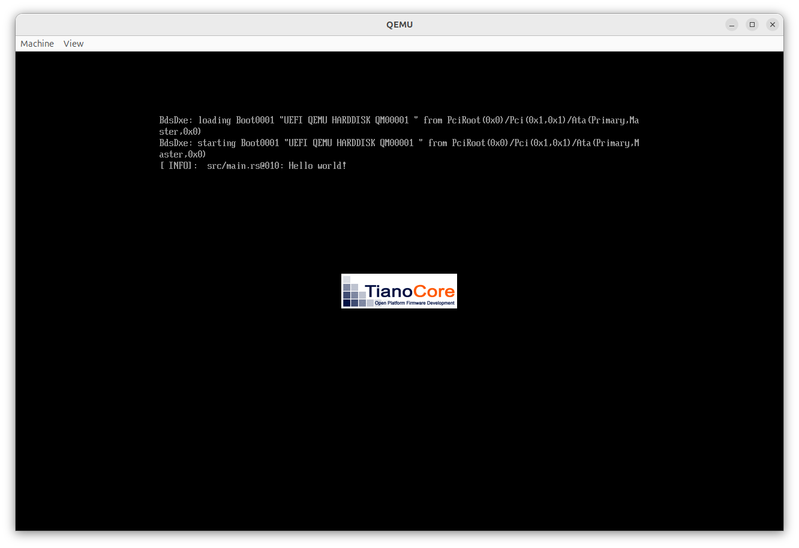
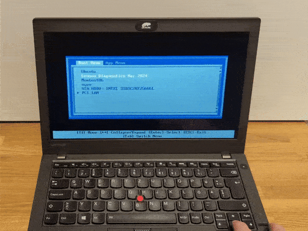
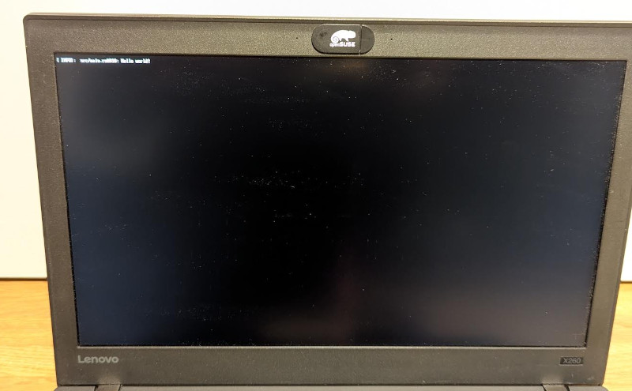

# Hello World

`Hello, World!`, but in [UEFI](https://en.wikipedia.org/wiki/UEFI).

UEFI is what the kids call the BIOS today.

My goal is not to replace the UEFI on my laptop, my goal is just to write an UEFI application which can be started from my laptop's stock UEFI boot menu.

The expected goal is

1. Turn on the laptop
2. Select `nyan` from the boot menu
3. Nyan!!! :cat:

No operating system, such as Linux or Windows, is running.

UEFI applications are [basically binaries in Windows PE format](https://wiki.osdev.org/UEFI#Binary_Format).
But, of course, Windows is not running at that point and no Windows DLLs or services are available.

## Getting started

The [Rust UEFI Book](https://rust-osdev.github.io/uefi-rs/) is an excellent and concise corpus to get started with with building an UEFI application in Rust.

Let's speedrun a `Hello, world!`, as described in the Rust UEFI Book.

```bash
$ cargo new my-uefi-app
$ cd my-uefi-app
$ cargo add log
$ cargo add uefi --features logger,panic_handler
```

The `src/main.rs`:

```rust
#![no_main]
#![no_std]

use log::info;
use uefi::prelude::*;

#[entry]
fn main() -> Status {
    uefi::helpers::init().unwrap();
    info!("Hello world!");
    boot::stall(10_000_000);
    Status::SUCCESS
}
```

```bash
$ cargo build --target x86_64-unknown-uefi
```

Let's run is, as described in [the Rust UEFI book](https://rust-osdev.github.io/uefi-rs/tutorial/vm.html), in qemu:



Great!


## Testing on real Hardware

Now let's test on real hardware!
It works in an emulator, so it will just work on my thinkpad, right?

I install the UEFI binary, boot into the boot menu, select the boot entry for the UEFI binary, ... and, ... nothing!



<!--
<video src="https://github.com/user-attachments/assets/80e30647-7129-43c1-b4b5-95985fba8be7" controls>
</video>
-->

Just nothing.
I select the UEFI app, the screen turns black for a fraction of a second, and I'm back into the boot menu.
No error message, no beeping, nothing.
What is wrong here?
How do we debug that?
Do I need to order a serial cable, since uefi-rs likes to also write `panic`s to the serial port?

I need to confess that I lied to you.
I did not test the Hello-World on real hardware.
The first time when I tested on real hardware, I was already much further down the road, having played with an allocator and colors.
So the error could be anything.
What did I do wrong with my code?
I added some `printf` debugging and sleeping, but my messages did not show up on the screen.
Clearly it must be allocator crate that I had enabled which crashed early, right?
Wrong!
I took one step back and started over.
Trying to just boot the minimal Hello, World example we just saw, straight from the book.
No custom code from my side.

And reducing this to a minimal example and removing all the moving parts really helped me to take one step back:
The Hello-World also did not boot!
Maybe, it's not my code which is crashing at all?

So let's take one step back further.
What happens when [I select my UEFI app in the boot menu](https://en.wikipedia.org/wiki/UEFI#Booting)?

1. The firmware did already detect my UEFI binary.
2. So it just checks the secure boot signature and boots it.

Wait, what?
Secure boot signature?
I did not set up any personal Machine Owner Keys and I definitely don't own the private Microsoft signing keys.
My binary is not signed.


Okay, what happens if I turn off secure boot in the BIOS (UEFI?) menu?



It works!

<video src="https://github.com/user-attachments/assets/f7c139e6-0343-439d-ae5a-8d5cf65c8850" controls>
</video>

Okay, not showing any error message at all if the secure boot check fails is not nice.
Let's create a [quick PR upstream](https://github.com/rust-osdev/uefi-rs/pull/1468) with the Rust UEFI book, so others are spared from this frustration.

And now, let's continue.

# Hello World! But convenient.


And run it, ...
Let's run in qemu first.
But we need to get an UEFI image first!
ovmf, with distro

```bash
$ sudo apt install ovmf
```

```
$ cp /usr/share/OVMF/OVMF_CODE_4M.fd .
```
