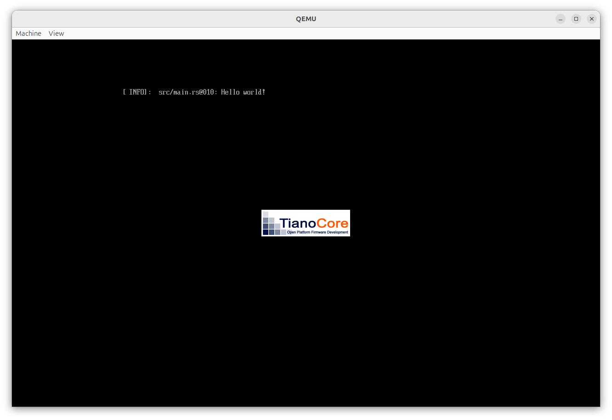

# Hello World

Let's write an `Hello, World!` app, but in [UEFI](https://en.wikipedia.org/wiki/UEFI).

UEFI is what the kids call the BIOS nowadays.

My goal is not to replace the UEFI on my laptop, my goal is just to write an UEFI application which can be started from my laptop's stock UEFI boot menu.

The expected goal is

1. Turn on the laptop
2. Select `nyan` from the boot menu
3. Nyan!!! :cat:

No operating system, such as Linux or Windows, is running.

UEFI applications are [basically binaries in Windows PE format](https://wiki.osdev.org/UEFI#Binary_Format).
But, of course, Windows is not running at that point and no Windows DLLs or services are available.

## Getting started

The [Rust UEFI Book](https://rust-osdev.github.io/uefi-rs/) is an excellent and concise corpus to get started with with building an UEFI application in Rust.

Let's speedrun a `Hello, world!`, as described in the Rust UEFI Book.

```bash
$ cargo new my-uefi-app
$ cd my-uefi-app
$ cargo add log
$ cargo add uefi --features logger,panic_handler
```

The `src/main.rs`:

```rust
#![no_main]
#![no_std]

use log::info;
use uefi::prelude::*;

#[entry]
fn main() -> Status {
    uefi::helpers::init().unwrap();
    info!("Hello world!");
    boot::stall(10_000_000);
    Status::SUCCESS
}
```

```bash
$ cargo build --target x86_64-unknown-uefi
```

Let's run is, as described in [the Rust UEFI book](https://rust-osdev.github.io/uefi-rs/tutorial/vm.html), in qemu:


<!--
By the way, on Ubuntu, I got a copy of an UEFI like this:


```bash
$ sudo apt install ovmf
$ cp /usr/share/OVMF/OVMF_CODE_4M.fd .
$ cp /usr/share/OVMF/OVMF_VARS_4M.fd .
```
-->

Great!


## Testing on real Hardware

Now let's test on real hardware!
It works in an emulator, so it will just work on my thinkpad, right?

I install the UEFI binary, boot into the boot menu, select the boot entry for the UEFI binary, ... and, ... nothing!


<!--
<video src="https://github.com/user-attachments/assets/80e30647-7129-43c1-b4b5-95985fba8be7" controls>
</video>
-->

Just nothing.
I select the UEFI app, the screen turns black for a fraction of a second, and I'm back into the boot menu.
No error message, no beeping, nothing.
What is wrong here?
How do we debug that?
Do I need to order a serial cable, since uefi-rs likes to also write `panic`s to the serial port?

I need to confess that I lied to you.
I did not test the Hello-World on real hardware.
The first time when I tested on real hardware, I was already much further down the road, having played with an allocator and colors.
So the error could be anything.
What did I do wrong with my code?
I added some `printf` debugging and sleeping, but my messages did not show up on the screen.
Clearly it must be the allocator crate that I had enabled which crashed early, right?
Wrong!
I took one step back and started over.
Trying to just boot the minimal Hello, World example we just saw.
Verbatim copied from the book.
No custom code from my side.

And reducing this to a minimal example and removing all the moving parts really helped me to take one step back:
The Hello-World also did not boot!
Maybe, it's not my code which is crashing at all?

So let's take one step back further.
What happens when [I select my UEFI app in the boot menu and press enter](https://en.wikipedia.org/wiki/UEFI#Booting)?

1. The firmware did already detect my UEFI binary.
2. So it just checks the secure boot signature and boots it.

Wait, what?
Secure boot signature?
I did not set up any personal [Machine Owner Keys](https://mjg59.dreamwidth.org/19448.html) and I definitely don't own the [private Microsoft signing keys](https://mjg59.dreamwidth.org/5552.html).
My binary is not signed.


Okay, what happens if I turn off secure boot in the BIOS (UEFI?) menu?


It works!

<video src="https://github.com/user-attachments/assets/f7c139e6-0343-439d-ae5a-8d5cf65c8850" controls>
</video>

Okay, not showing any error message at all if the secure boot check fails is not nice.
Let's create a [quick PR upstream](https://github.com/rust-osdev/uefi-rs/pull/1468) with the Rust UEFI book, so others are spared from this frustration.

And now that we have `Hello, World` on real hardware, let's continue.

## Hello World! But convenient

Right now, my developer workflow is as follows

1. `cargo build`
2. Why does it build so much? And why won't it compile with the error `error: unwinding panics are not supported without std`?
3. Oh, I forgot `--target x86_64-unknown-uefi`. :angry:
4. `cargo clean` :unamused:
5. `cargo build --target x86_64-unknown-uefi`
6. `cp` the binary to my `qemu` location and run qemu.

I think this can be improved.

First, let's define `--target x86_64-unknown-uefi` as the default.
I found that this can be specified in the local `.cargo/config.toml`: 

```toml
[build]
target = "x86_64-unknown-uefi"
```

Now, running `cargo build` does the right thing.

Can this be more convenient? Can we just run `cargo run`?

```bash
$ cargo run 
    Finished `dev` profile [unoptimized + debuginfo] target(s) in 0.01s
     Running `target/x86_64-unknown-uefi/debug/my-uefi-app.efi`
target/x86_64-unknown-uefi/debug/my-uefi-app.efi: 3: Syntax error: "(" unexpected (expecting ")")
```

Well, no, UEFI apps don't run natively under Linux, we need to start them in qemu.
Fortunately, the `.cargo/config.toml` has the feature to specify [target runners](https://doc.rust-lang.org/cargo/reference/config.html#target).


So, with `esp` being my local folder which I pretend to be the efi system partition, let's try the following `.cargo/config.toml`:

```toml
[build]
target = "x86_64-unknown-uefi"

[target.x86_64-unknown-uefi]
runner = "qemu-system-x86_64 -enable-kvm -drive if=pflash,format=raw,readonly=on,file=OVMF_CODE.fd -drive if=pflash,format=raw,readonly=on,file=OVMF_VARS.fd -drive format=raw,file=fat:rw:esp"
```

```bash
$ cargo run
    Finished `dev` profile [unoptimized + debuginfo] target(s) in 0.01s
     Running `qemu-system-x86_64 -enable-kvm -drive if=pflash,format=raw,readonly=on,file=OVMF_CODE.fd -drive if=pflash,format=raw,readonly=on,file=OVMF_VARS.fd -drive 'format=raw,file=fat:rw:esp' target/x86_64-unknown-uefi/debug/my-uefi-app.efi`
qemu-system-x86_64: target/x86_64-unknown-uefi/debug/my-uefi-app.efi: drive with bus=0, unit=0 (index=0) exists
```

What a strange error message.
What does it mean?
Looks like `cargo run` appends the name of the compiled binary to the runner?
Can we reproduce this error message?

```bash
$ qemu-system-x86_64 -drive 'format=raw,file=fat:rw:esp' target/x86_64-unknown-uefi/debug/my-uefi-app.efi
qemu-system-x86_64: target/x86_64-unknown-uefi/debug/my-uefi-app.efi: drive with bus=0, unit=0 (index=0) exists
```

It's the same error.
So we confirmed the hypothesis that `cargo run` adds the path to the compiled binary and qemu does not like this.
So I thought: "Hey, what about adding a dummy flag to qemu at the end which consumes the path added by `cargo run`, but which gets ignored hopefully".
I tried the `-kernel` flag.

```bash
$ qemu-system-x86_64 -enable-kvm -drive if=pflash,format=raw,readonly=on,file=OVMF_CODE.fd -drive if=pflash,format=raw,readonly=on,file=OVMF_VARS.fd -kernel target/x86_64-unknown-uefi/debug/my-uefi-app.efi
```



:astonished:

To my surprise, this just booted my UEFI binary directly!
The `-kernel` flag was supposed to boot a Linux kernel.
I did not expect that it can start UEFI apps!
I thought I have to emulate an efi system partition.
I don't know why this works, but it works.
Does this have to do with the [unified kernel images](https://wiki.archlinux.org/title/Unified_kernel_image)?
Anyway, it works!

In addition, I found that uefi-rs likes to write `panic`s to the serial console.
So let's enable one in qemu.

Eventually, my `.cargo/config.toml` looks like this:

```toml
[build]
target = "x86_64-unknown-uefi"

[target.x86_64-unknown-uefi]
runner = "qemu-system-x86_64 -enable-kvm -drive if=pflash,format=raw,readonly=on,file=OVMF_CODE_4M.fd -drive if=pflash,format=raw,readonly=on,file=OVMF_VARS_4M.fd -serial stdio -kernel"
```

And this allows to just type `cargo run`, which now compiles the UEFI binary and runs it in qemu.

Now we have a convenient development setup and can get started! :crab:

[back](../)
