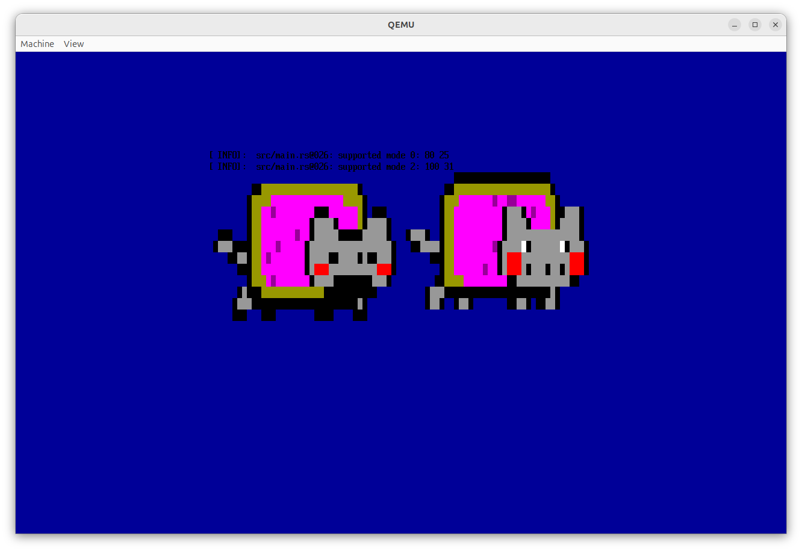
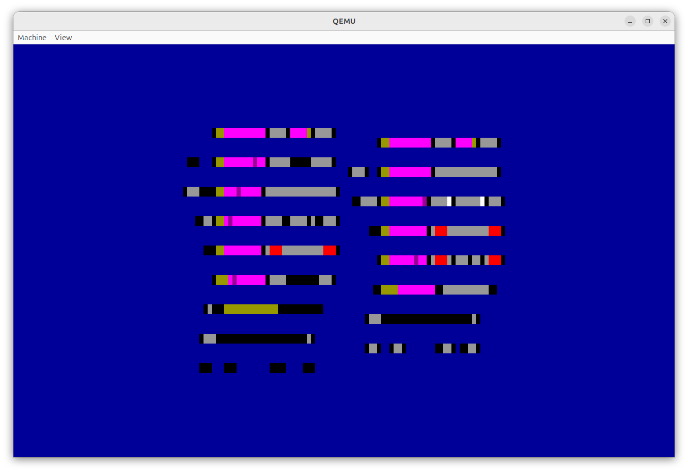
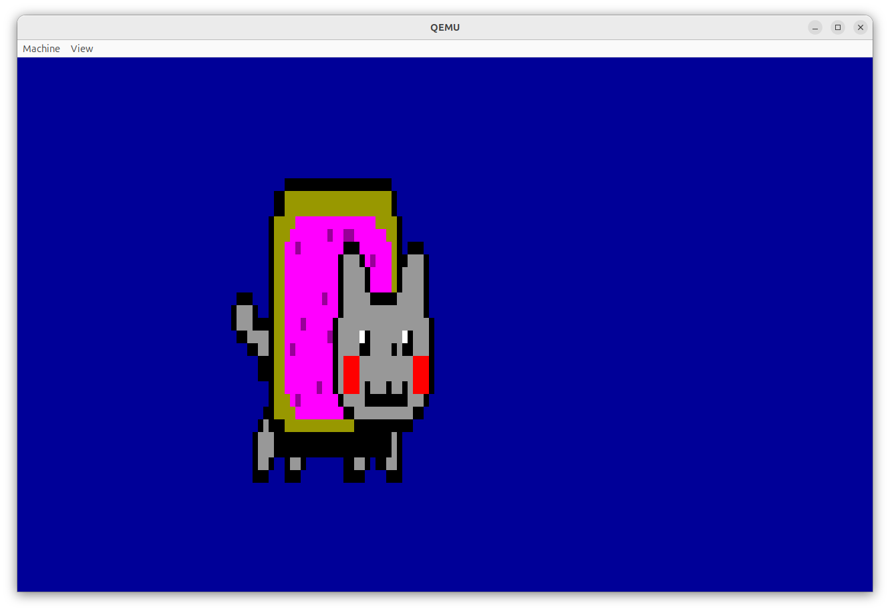
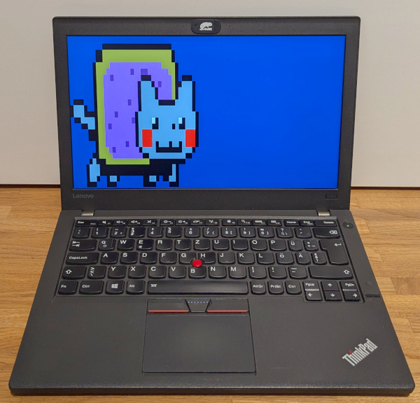
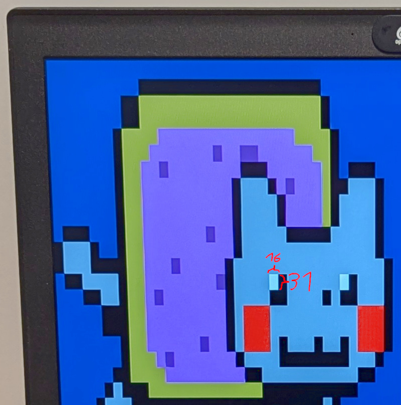
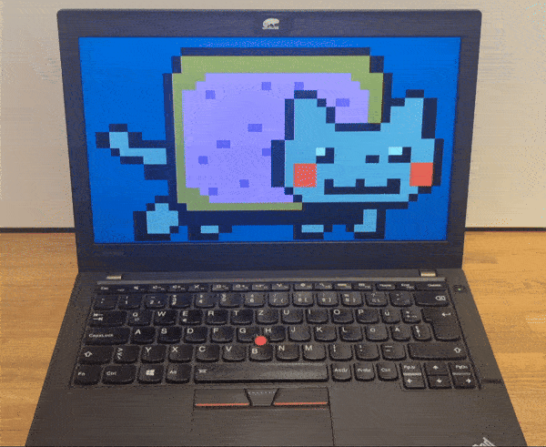

# Putting It All Together

## Drawing the `NYAN_40X25` Array

Let'd draw the array!
Our simple program from the previous chapter is almost ready, [let's adapt it](https://github.com/diekmann/uefi_nyan_80x25/commit/e79bb0f93f2a5cb52ade54a5b478a8a76b95337f#diff-8604ed4b2e74eddb20dce286c605a4cfb983f26421d5efb8c730b277e5dc62c2).

```rust
#![no_main]
#![no_std]

use log::info;
use uefi::prelude::*;
use uefi::proto::console::text::Color::{Blue,Black};

mod nyan;

const BLOCKELEMENT_FULL_BLOCK: uefi::Char16 = unsafe {uefi::Char16::from_u16_unchecked(0x2588 as u16)};

#[entry]
fn main() -> Status {
    uefi::helpers::init().unwrap();
    let background = Blue;
    system::with_stdout(|stdout| -> uefi::Result {
        let must_mode_80x25 = stdout.modes().next().unwrap(); // the first one must be the 80x25 mode.
        stdout.set_mode(must_mode_80x25)?;

        // Paints the whole background blue. This is even a documented feature of `set_color`+`clear`.
        stdout.set_color(Black, background)?;
        stdout.clear()?;

        // Dump all modes.
        for m in stdout.modes() {
            info!("supported mode {}: {} {}", m.index(), m.columns(), m.rows());
        }
        
        for color in nyan::NYAN_40X25 {
            stdout.set_color(color, background)?;
            let mut s = uefi::CString16::new();
            s.push(BLOCKELEMENT_FULL_BLOCK);
            stdout.output_string(&s)?;
        }
        Ok(())
    }).expect("talking to EFI Simple Text Output Protocol went wrong");
    boot::stall(10_000_000);
    Status::SUCCESS
}
```

```bash
$ cargo run
```



Wait?
Why are there two nyan cats?
Am I drunk?

Okay, we set the ~~resolution~~ mode to 80x25.
This means, we can draw 80 characters before an automated linebreak occurs.
Our nyan cat image was scaled down to 40x25.
If we draw it without explicit line breaks, because 80 = 40·2, we accidentally draw two nyan cats next to each other.
We also only drew 13 instead of 25 lines, that's why the debug text at the top still shows up.

Let's add a linebreak.

```diff
diff --git a/nyan/src/main.rs b/nyan/src/main.rs
index a2f09a4..ea76b1a 100644
--- a/nyan/src/main.rs
+++ b/nyan/src/main.rs
@@ -8,6 +8,7 @@ use uefi::proto::console::text::Color::{Blue,Black};
 mod nyan;
 
 const BLOCKELEMENT_FULL_BLOCK: uefi::Char16 = unsafe {uefi::Char16::from_u16_unchecked(0x2588 as u16)};
+const NEWLINE: uefi::Char16 = unsafe { uefi::Char16::from_u16_unchecked(b'\n' as u16) };
 
 #[entry]
 fn main() -> Status {
@@ -26,10 +27,13 @@ fn main() -> Status {
             info!("supported mode {}: {} {}", m.index(), m.columns(), m.rows());
         }
         
-        for color in nyan::NYAN_40X25 {
-            stdout.set_color(color, background)?;
+        for (i, color) in nyan::NYAN_40X25.iter().enumerate() {
+            stdout.set_color(*color, background)?;
             let mut s = uefi::CString16::new();
             s.push(BLOCKELEMENT_FULL_BLOCK);
+            if i%40 == 0 {
+                s.push(NEWLINE);
+            }
             stdout.output_string(&s)?;
         }
         Ok(())
```



Hmmm, :confused:

Oh right, UEFI is basically Windows-style.
We did UNIX-like `\n` linebreaks.
Let's try Windows-style `\r\n` with explicit carriage return.
It's the first time I actually see how a newline looks like if the cursor is not returned to the beginning of the line.

```diff
diff --git a/nyan/src/main.rs b/nyan/src/main.rs
index ea76b1a..c2e5a4b 100644
--- a/nyan/src/main.rs
+++ b/nyan/src/main.rs
@@ -8,6 +8,7 @@ use uefi::proto::console::text::Color::{Blue,Black};
 mod nyan;
 
 const BLOCKELEMENT_FULL_BLOCK: uefi::Char16 = unsafe {uefi::Char16::from_u16_unchecked(0x2588 as u16)};
+const CARRIAGE_RET: uefi::Char16 = unsafe { uefi::Char16::from_u16_unchecked(b'\r' as u16) };
 const NEWLINE: uefi::Char16 = unsafe { uefi::Char16::from_u16_unchecked(b'\n' as u16) };
 
 #[entry]
@@ -32,6 +33,7 @@ fn main() -> Status {
             let mut s = uefi::CString16::new();
             s.push(BLOCKELEMENT_FULL_BLOCK);
             if i%40 == 0 {
+                s.push(CARRIAGE_RET);
                 s.push(NEWLINE);
             }
             stdout.output_string(&s)?;
```

```bash
$ cargo run
```



Nice!!

:tada: :smile_cat: :confetti_ball: :confetti_ball: :smile_cat: :tada:




<!-- img/nyanboot.mp4 -->
<video src="https://github.com/user-attachments/assets/f370eeb1-6ff1-470f-be6a-51b20ed963f7" controls>
</video>

Meow!


## Drawing as `NYAN_80X25` Array

But let's revisit a note from earlier, when we accidentally drew two nyan cats side by side.
The proportions of those two nyan cats looked quite good.
This image looks horizontally stretched.
We accidentally built longcat.

The reason for longnyancat is that `BLOCKELEMENT_FULL_BLOCK` is not a perfect square.



When downsizing nyan cat, we assumed we are drawing him as perfect square pixels.
I.e., we assumed `BLOCKELEMENT_FULL_BLOCK` is a perfect square with an aspect ratio of 1x1.

But `BLOCKELEMENT_FULL_BLOCK` renders as 8x19 on qemu or roughly 16x31 on my Thinkpad x260.
For simplicity, let's assume the ratio is 1:2.

We need to scale the original nyan cat image without preserving its aspect ratio.
But we need to sclae it down such that it has its original aspect ration again when drawn with `BLOCKELEMENT_FULL_BLOCK` of an aspect ratio 1:2.
In other words, we need to scale down the height twice as much as the width.

In the beginning, we scaled down the image from 272x168 to 40x25, preserving the aspect ration.
We could scale this down to 40x12-ish to cater for the 1:1 `BLOCKELEMENT_FULL_BLOCK`.
But wait, we have a drawing space of 80x25!
We could scale down the original image, preserving the aspect ratio, to 80x49.
And if we now half the height, we ens up at a purrrfect 80x25!
Just like nyan cat was made for this!

Okay, remember the ~~annoying~~ exciting Gimp journey?
Time to start over and do the whole thing again.
And while I'm at it, let's do everything twelve times, once per animation frame, so nyan cat is moving.

Okay, [here is the `main.rs`](https://github.com/diekmann/uefi_nyan_80x25/blob/fe922824ca61677c77cfa7314dc21c5e9fba2350/nyan/src/main.rs).

**TODO: inline final code**

<!-- Thanks ezgif.com for converting to this small gif. -->


Okay, "where is the rainbow?" you ask?
Fine, let me start over the Gimp journey again. :unamused:
Maybe I can also optimize the colors and specific frames a bit.


[back](../)
